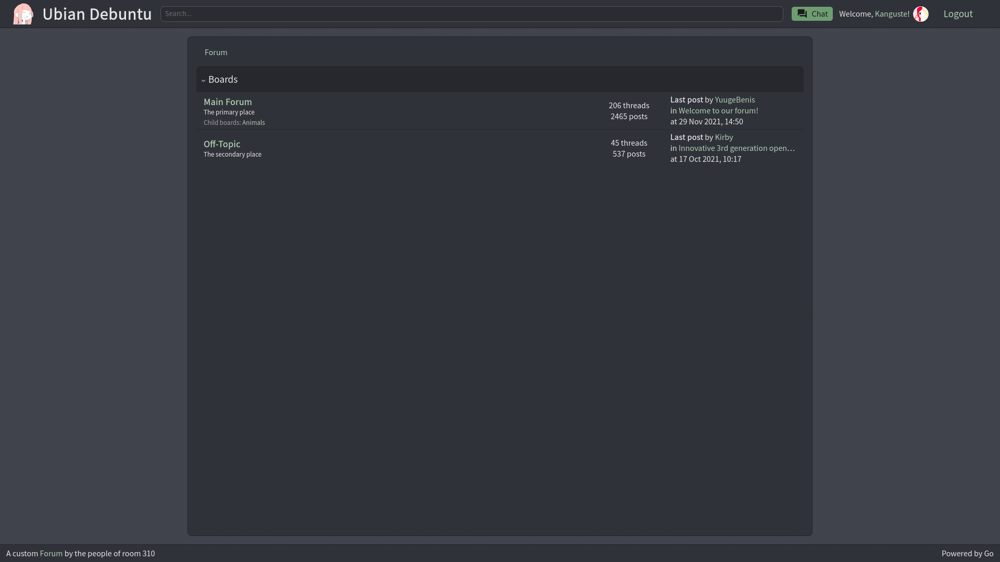

# Real Time Forum

## **Hello, welcome to our forum!**

## Authors

> ### [Olaroll](https://github.com/Olaroll) - Olari Tsernobrovkin
>
> ### [Kanguste](https://github.com/MM1132) - Robert Reimann
>
> ### [Urist](https://github.com/uristdwarf/) - Urmas Rist
>
> ### [Kris](https://github.com/kris-01) - Kris Uibopuu

 

## Notable features:

-   Sorting threads by different columns
-   Changing your profile's picture and description
-   See any user's recent posts, also likes and dislikes on their profile page
-   Click on a tag in the thread listing to show all threads with that tag
-   Also send private messages to other users in the chat

## Run with docker

1. Clone the repository
2. Make sure docker is installed and running
3. Navigate to the project's root directory (should be called `real-time-forum`)
4. Run `sh ./docker/build_docker.sh`
5. Run `sh ./docker/run_docker.sh`
6. Try connecting to the forum with `localhost:8080` from browser

## Run manually

0. Clone the repository
1. Navigate to the project's root directory (should be `real-time-forum`)
2. Make sure Golang is installed
3. Install all the required packages
4. Run with `go run .`
5. Connect to `localhost:8080` from browser

## Used third party software

-   Text editor: [CKEditor5](https://ckeditor.com/ckeditor-5/) - [GPLv2+](https://ckeditor.com/legal/ckeditor-oss-license/)
-   Svg icons: [Material Design Icons](https://materialdesignicons.com/) - [Various licenses](https://github.com/Templarian/MaterialDesign/blob/master/LICENSE)
